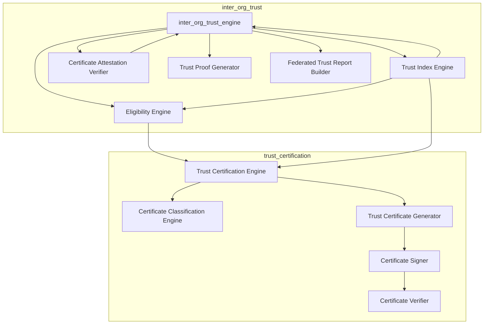
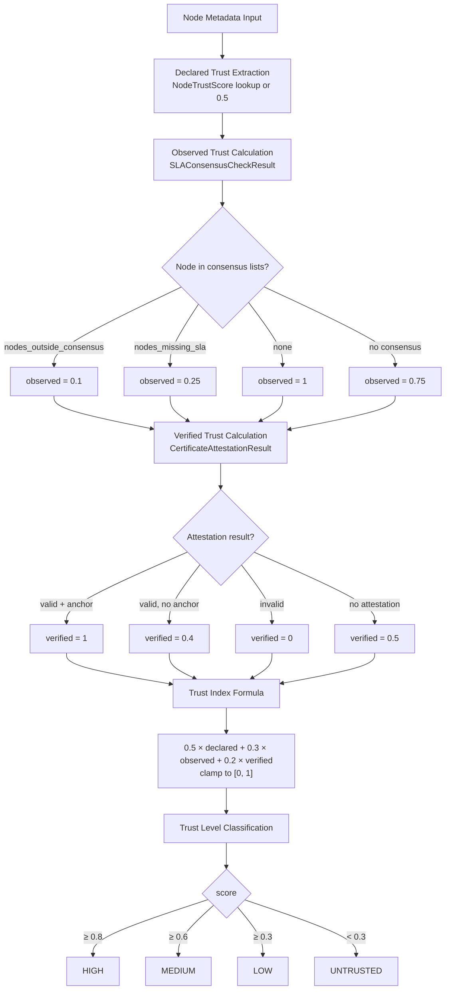
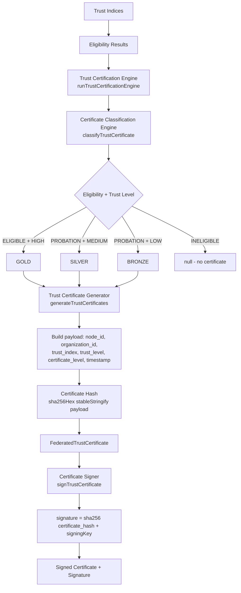
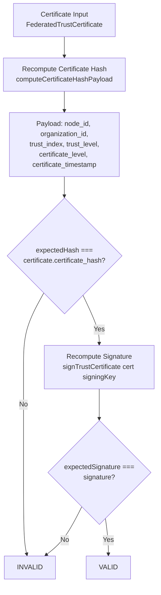

# IRIS Protocol — Phase 11 Architecture Diagrams

This document contains C4-style and protocol-flow architecture diagrams for the **Trust Governance Layer** (Phase 11), reflecting the implementation in `src/network/inter_org_trust/` and `src/network/trust_certification/`.

---

## 1 — System Context Diagram (C4 Level 1)

Global context: Federated Organizations and IRIS Nodes supply inputs to the IRIS Trust Governance Layer; the layer produces Trust Reports, Trust Proofs, and Trust Certificates consumed by External Audit Systems.

```mermaid
flowchart LR
    subgraph Actors
        OrgA[Federated Organization A]
        OrgB[Federated Organization B]
        Node[IRIS Node]
    end

    subgraph System["IRIS Trust Governance Layer"]
        TrustLayer[Trust Governance Layer]
    end

    Audit[External Audit System]

    OrgA -->|node metadata, trust scores, SLA signals| Node
    OrgB -->|node metadata, trust scores, SLA signals| Node
    Node -->|node metadata, trust scores, SLA consensus, node records, trust anchors| TrustLayer
    TrustLayer -->|FederatedTrustReport, TrustProof, FederatedTrustCertificate[]| Audit
```

---

## 2 — Container Diagram (C4 Level 2)

Major subsystems of Phase 11 and data flow between them.



---

## 3 — Component Diagram (C4 Level 3)

Components inside `src/network/inter_org_trust/` and their interactions.

```mermaid
flowchart TB
    subgraph Inputs
        Meta[node metadata<br/>NodeMetadataWithCommitment[]]
        Scores[trust scores<br/>NodeTrustScore[]]
        SLA[SLA consensus<br/>SLAConsensusCheckResult]
        Records[node records<br/>FederatedNodeRecord[]]
        Anchors[trust anchors<br/>TrustAnchor[]]
    end

    subgraph inter_org_trust
        Engine[inter_org_trust_engine]
        TrustIdx[trust_index_engine]
        Attest[certificate_attestation_verifier]
        Proof[trust_proof_generator]
        Report[federated_trust_report_builder]
    end

    subgraph Outputs
        Indices[node_trust_indices<br/>NodeTrustIndex[]]
        ProofOut[TrustProof]
        ReportOut[FederatedTrustReport]
    end

    Meta --> Engine
    Scores --> Engine
    SLA --> Engine
    Records --> Engine
    Anchors --> Engine

    Engine --> Attest
    Attest --> Engine
    Engine --> TrustIdx
    TrustIdx --> Indices
    Engine --> Proof
    Indices --> Proof
    Proof --> ProofOut
    Engine --> Report
    Indices --> Report
    ProofOut --> Report
    Report --> ReportOut
```

---

## 4 — Trust Index Computation Flow

Protocol flow for trust index calculation (declared → observed → verified → formula → level).



---

## 5 — Certificate Eligibility Flow

Eligibility process from trust indices to status and reason.

```mermaid
flowchart TB
    A[Trust Indices<br/>NodeTrustIndex[]] --> B[Eligibility Engine<br/>evaluateCertificateEligibility]
    B --> C[Sort by node_id]
    C --> D[Map trust_level to status]
    D --> E{Eligibility Status}
    E -->|HIGH trust| F[ELIGIBLE<br/>reason: TRUST_HIGH]
    E -->|MEDIUM trust| G[PROBATION<br/>reason: TRUST_MEDIUM]
    E -->|LOW trust| H[PROBATION<br/>reason: TRUST_LOW]
    E -->|UNTRUSTED| I[INELIGIBLE<br/>reason: NODE_UNTRUSTED]
    F --> J[NodeCertificateEligibility[]]
    G --> J
    H --> J
    I --> J
```

---

## 6 — Trust Certification Flow

End-to-end flow in `src/network/trust_certification/`: indices + eligibility → classification → generation → hash → signing.



---

## 7 — Certificate Verification Flow

Verification steps: recompute hash, recompute signature, compare.



---

## 8 — Deterministic Trust Proof Chain

How trust proof and report hashes are produced deterministically.

```mermaid
flowchart TB
    A[Trust Indices<br/>NodeTrustIndex[]] --> B[Attestation Results]
    B --> C[Trust Proof Generator<br/>generateTrustProof]
    C --> D[Trust Summary<br/>total_nodes, average_trust_index,<br/>highest_trust_node, lowest_trust_node,<br/>verified_node_count, untrusted_node_count]
    D --> E[Payload: timestamp, evaluated_nodes,<br/>trust_summary, node_trust_indices,<br/>attestation_results]
    E --> F[Stable Serialization<br/>stableStringify - sorted keys]
    F --> G[SHA-256 Hash]
    G --> H[Trust Proof<br/>trust_hash, timestamp, evaluated_nodes, trust_summary]
    H --> I[Federated Trust Report Builder<br/>buildFederatedTrustReport]
    I --> J[Payload: node_trust_indices,<br/>attestation_results, trust_proof]
    J --> K[Stable Serialization]
    K --> L[SHA-256 Hash]
    L --> M[Report Hash]
    M --> N[FederatedTrustReport<br/>report_hash]
```
